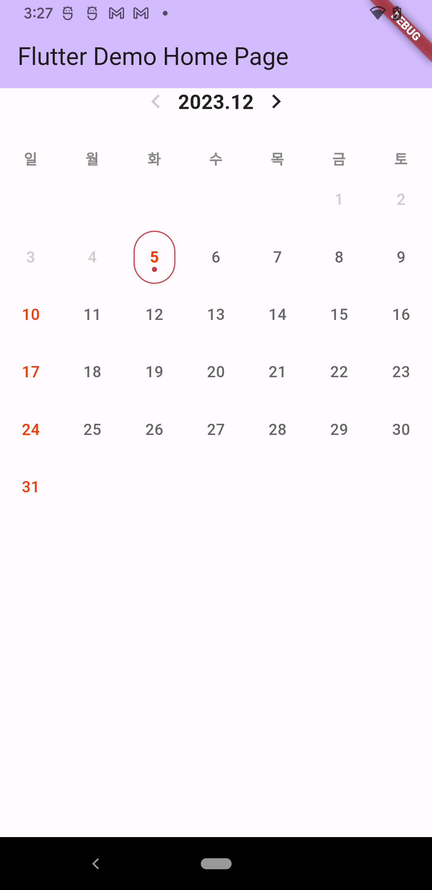

<p align="center">
  
</p>
 
<h1 align="center">Flutter Calendar</h1>

 ## Example


```dart
class _MyHomePageState extends State<MyHomePage> {
  @override
  Widget build(BuildContext context) {
    DateTime startDateTime = DateTime.now();
    DateTime endDateTime = DateTime.now().add(const Duration(days: 365));
    return Scaffold(
      appBar: AppBar(
        backgroundColor: Theme.of(context).colorScheme.inversePrimary,
        title: Text(widget.title),
      ),
      body: Calender(
        startDateTime: startDateTime,
        selectCallback: (DateTime dateTime) {
          print(dateTime.toString());
        },
        endDateTime: endDateTime,
        disableSelectedCallback: () {
          print("선택 안되는 날짜");
        },
        isTodayColor: true,
      ), // This trailing comma makes auto-formatting nicer for build methods.
    );
  }
}
```
 
## Preview

<p align="center">
  
</p>
 
 
### Updates
### 1.0.0